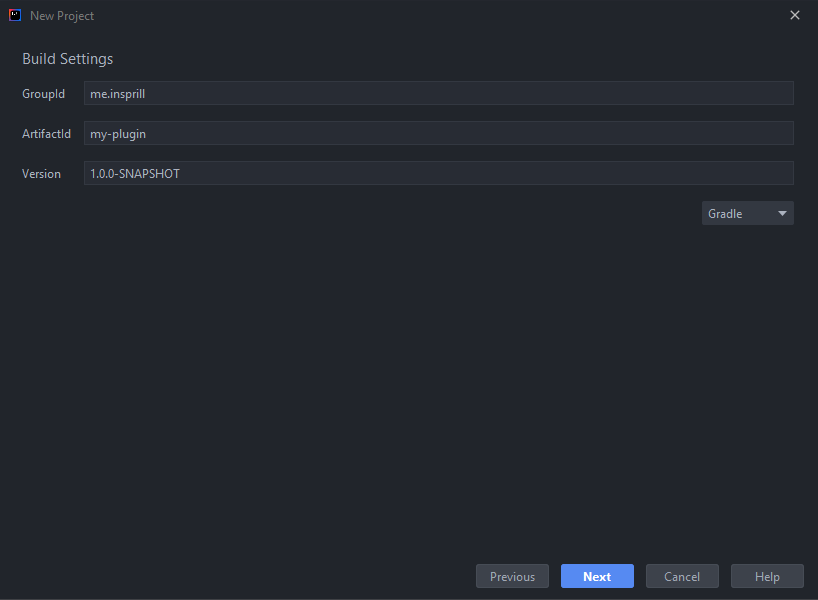

# IntelliJ

### Install with Toolbox

JetBrains [Toolbox](https://www.jetbrains.com/toolbox-app/) is a handle little program that makes managing all your JetBrains IDE's a breeze.



1. Download the install's .exe from [Toolbox](https://www.jetbrains.com/toolbox-app/)'s webpage.
2. Run the installer and follow all the steps until it's installed.
3. Once Toolbox is running, click on its icon in the notification tray..png>)\
   At the top, you can see the applications you currently have installed, along with their versions. You can click the 3 dots on the right of each application to modify its settings.
4. To enable Dark Mode, click the hexagon in the top right, click Settings, then select the dark theme.
5. Click "Install" next to "IntelliJ IDEA Community Edition" to install it.



Coming soon



Coming soon



### Install Standalone



1. Go to IntelliJ's [download page](https://www.jetbrains.com/idea/download/#section=windows), and download the Community Edition's .exe.
2. Run the installer and follow all steps until it's installed.



Coming soon



Coming soon



### Plugins

When you launch IntelliJ for the first time, you will see the Welcome screen. The first thing you should do is install some plugins. To do this, click on the Plugins tab on the left, then Marketplace at the top. Then you can search for plugins. These are some of the plugins we recommend you install.

* &#x20;[**One Dark Theme**](https://plugins.jetbrains.com/plugin/11938) _by_ [_Mark Skelton_](https://github.com/one-dark/jetbrains-one-dark-theme)__\
  __.png>)\
  To start using One Dark Theme, go to Settings -> Appearance & Behavior -> Appearance, and at the top change the Theme to whichever One Dark variant you prefer.
* ****[**Rainbow Brackets**](https://plugins.jetbrains.com/plugin/10080) _by_ [_izhangzhihao_](https://github.com/izhangzhihao)__\
  __Changes the colours of each pair of brackets and parentheses making them easier to distinguish.\
  .png>)
* ****[**Atom Material Icons**](https://plugins.jetbrains.com/plugin/10044) **** _by_ [_Atom Material Themes & Plugins_](https://plugins.jetbrains.com/organizations/AtomMaterial)__\
  __Changes almost all icons to be easier to distingush at a glance.\
  .png>)
* ****[**Discord Integration**](https://plugins.jetbrains.com/plugin/10233) _by_ [_Almighty Alpaca_](https://github.com/Almighty-Alpaca)__\
  __Shows what you're currently working on in your Discord Rich Presence. Fully configurable to show only what you want.\
  .png>)****
* ****[**Key Promoter X**](https://plugins.jetbrains.com/plugin/9792) _by_ [_Hal's Corner_](https://plugins.jetbrains.com/organizations/halirutan)__\
  __Helps you to learn essential keyboard shortcuts while you are working.\
  .png>)
* ****[**Minecraft Development**](https://plugins.jetbrains.com/plugin/8327) **** _by_ [_Minecraft Dev_](https://plugins.jetbrains.com/organizations/minecraft-dev)__\
  __Adds tools to help speed up the development of various Minecraft-related projects.\
  .png>)
* ****[**String Manipulation**](https://plugins.jetbrains.com/plugin/2162) _by Vojtech Krasa, Olivier Smedile_\
  __Allows you to easily switch cases, sort, filter, increment, align to columns, grep, escape encoding, and much more on any text.
* ****[**GitToolBox**](https://plugins.jetbrains.com/plugin/7499) _by_ [_Lukasz Zielinski_](https://github.com/zielu)__\
  __Extends Git Integration with additional features such as status display, auto fetch, inline blame annotation, commit dialog completion, behind notifications, and more.

### Creating a Project

Now that your IDE is set up, you can create your first project. For this example, we'll be creating a Spigot plugin. Assuming you're still on the Welcome screen, click Projects on the left, then New Project. On the left, select Minecraft, then select Spigot Plugin, and hit next.

.png>)

Next, you will enter some information about the project.

* **GroupId** - A unique base name of the company or group that created the project. For personal projects, `me.name` is recommended.
* **ArtifactId -** A unique name of the project.
* **Version -** The initial version of the project.

In the bottom dropdown, you can select between Maven and Gradle. Personally, I recommend using Gradle.

On the next page, you will enter more information about your plugin, most of which will be used in the plugin.yml which tells the server information about your plugin.

* **Plugin Name** - The name of your plugin that will be displayed on the server. This also dictates the name of the config folder.
* **Main Class Name** - The name of the Main class. It's recommended to have to as the name of your plugin.
* **Minecraft Version** - What Minecraft version your plugin is targeting.
* **Description** - A short description of your plugin.
* **Authors** - The authors of your plugin.
* **Website** - A link to a website related to your plugin. Can be a link to the Spigot page, GitHub, or whatever you want.
* **Log Prefix** - The prefix that will be used in any messages your plugin logs to the console.
* **Load Before** - A list of all plugins your plugin should load before.
* **Load at** - What stage in the sever startup sequence your plugin loads at.
* **Depend** - A list of plugins that your plugin cannot function without.
* **Soft Depend** - A list of plugins that your plugin uses parts of (an API for example) but does not require.

.png>)

Next, you enter the final 2 settings. The name of your project, and the location on disk where it should be created. The name should be the same as the Plugin Name you entered in the previous step.

.png>)

Then click Finish and you're good to go!\
If you get a prompt saying "Directory Does Not Exist", just click create.\
&#x20;.png>)

